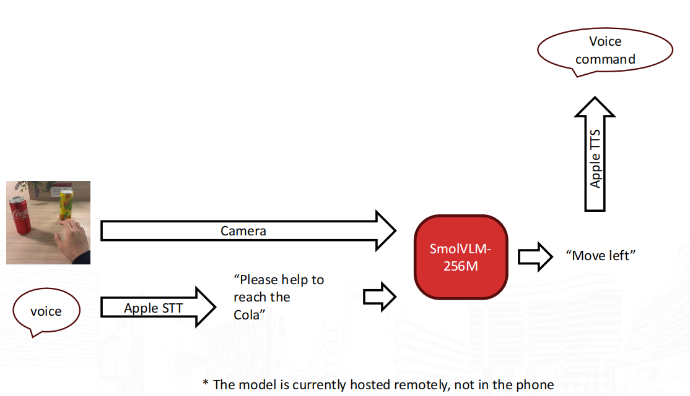
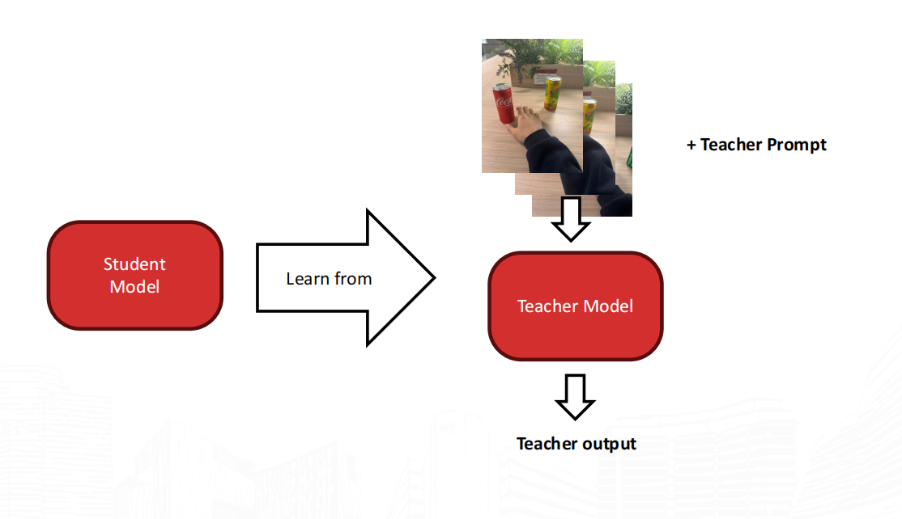
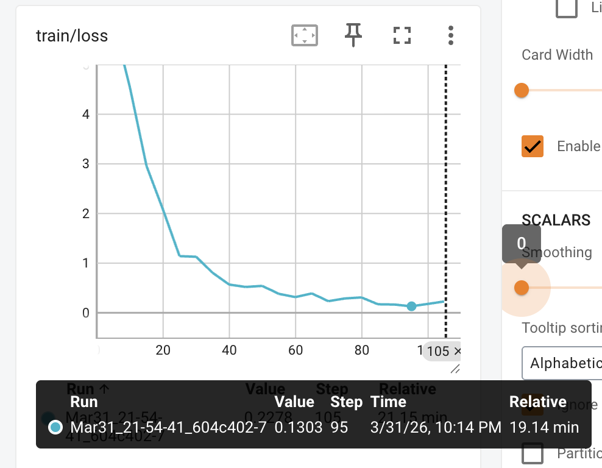

# Interactive Vision-Assisted Object Grasping for the Visually Impaired
[This is the GitHub Link](https://github.com/ethanncai/COMP5523)

## 1. Project Overview

This project is used for helping the blind people to locate and grasp something (Our project mainly focus on baverages), this system contains TTS,STT,VLM and more. The app was designed to let the blind user using their voice to interact, and give fast and informative feedback on its target. A user  says the object they want to pick up, such as cola or Sprite. The app take the latest frame and sends it to the backend server(Running an VLM). And finally the server returned some simple but informative instruction, such as "move left", "move forward", or "grab now". The application will reads this instruction aloud using TTS and continues the process loop until the user get what they want.

## 2. App Module

The `app` module is the interactive front end of the project and is responsible for turning the model into a usable assistive tool. The app provides a real-time workflow in which the user speaks a target object, the device captures the surrounding scene, and the system returns spoken step-by-step guidance. This module is therefore not only a visualization layer, but also the component that manages user interaction, device permissions, media input, networking, and speech output.

### 2.1 Startup and Preparation Logic

On launch, the view asynchronously configures the `AVAudioSession` in `.playAndRecord` mode, starts the camera, requests speech and microphone permissions, verifies server connectivity via `model.load()`, and begins distributing video frames to the UI. All checks complete before a `preparationComplete` flag is set, keeping the interface disabled until every component is ready. The early initialization can avoid delays and diagnostic difficulties as permissions and back-end availability check at the beginning of the interaction.

### 2.2 Speech Interaction Design

Speech input is implemented in `SpeechRecognizer.swift`, which defines a four-state machine (`idle`, `preparing`, `recording`, `finalizing`). These explicit phases prevent the app from starting a new recording before the previous transcription has fully completed.

The push-to-talk interaction uses a `DragGesture(minimumDistance: 0)` in `ContentView.swift`: recording starts on touch-down and stops on release. A `pushToTalkArmed` flag ensures the recognizer is triggered only once per press. After release, `handleUserCommand()` waits briefly for the finalizing phase to finish, then stores the transcript in `userGoalSpeech` and strips common prefixes such as "I want to pick up" to extract a cleaner target label for display.

### 2.3 Camera Pipeline and Frame Management

The camera subsystem is implemented in 、`CameraController.swift`, which wraps `AVCaptureSession` and gives priority to wide-angle or ultra-wide-angle cameras so that the user's hand and the target object can be visible in the same frame.

Captured frames flow through `AsyncStream<CMSampleBuffer>` → `AsyncStream<CVImageBuffer>` with `.bufferingNewest(1)`, which means only the latest frame is retained. This avoids accumulating lag during slower inference or speech playback. `VideoFrameView.swift` renders the preview, while `ContentView` independently stores `latestFrame` for inference, keeping display and model logic decoupled. On iOS, `AVCaptureDevice.RotationCoordinator` dynamically corrects orientation as the device moves.

### 2.4 Continuous Guidance Loop

The core runtime behavior is the continuous guidance loop in `startGuidanceLoop()`. After the user speaks a command, the app repeatedly reads the latest frame, constructs a prompt, calls remote inference, speaks the returned instruction aloud, and waits until playback finishes before starting the next iteration. Users can terminate process by `stopGuidance()` that means  the task is canceled and all states are reset.

### 2.5 Prompt Construction and Response Constraints

The prompt is generated by `ConcisePromptTemplate.swift`. Newlines are removed, quotation marks are normalized, and the text is trimmed before inclusion. The prompt tells the model that it is guiding a blind user to grasp the requested drink and that it should reply with one short spoken command only.

## 3. Server Module

The server is basically an API running on some device, this is also where out model was actually run. We keep the trained model alive on this module and exposed a simple HTTP API, so the app can easily use the service.. In the entire system view, the server act as an bridge between the application and trainer as well as the trainng outcomes. 

### 3.1 Service Interface and API Design

we do have two APIs, the one is called  GET/ health, simply returns it the model is alive or responsive. the second is an POST/ infer, this is the most important part, we let user input pictures and texts , and return it by string(text). we do have parameter: max_new_tokens for generation limit. of this API, we also use json for msg return(mainly the decoded text)

### 3.2 Model Lifecycle Management

The model will be loaded only once when application startup rather than once per request. This is handled through FastAPI's lifespan function. During startup, the server reads `SMOL_MODEL_PATH`, `SMOL_ADAPTER_PATH`, and the optional `SMOL_DEVICE`, then calls `load_model_and_processor()`. The returned model, processor, and resolved device are stored in a process-level dictionary named `_state`.

This design has several advantages. First of all, it avoids the extremely high cost of repeatedly loading multimodal models and adapters in each request. Secondly, it maintains a low enough reasoning delay for interactive use. Finally, it brings the server architecture closer to the real deployment service, in which the model initialization cost is very high, but the reasoning calls are frequent. 

### 3.3 Request Handling Flow

The `/infer` endpoint validates the `max_new_tokens` range, reads and decodes the uploaded image to RGB via Pillow, retrieves the preloaded model and processor from `_state`, runs the shared inference function, and returns a JSON response containing both a cleaned `text` field and a `raw` field. The client can distinguish errors according to different status codes which facilitates fixing issues.

## 4. Trainer Module

### 4.1 Dataset Construction

We use an larger VLM (Qwen3VL) to generate dataset rather than labeled them fully by just our hand. Qwen3VL is used to examine each image and produce short command for  how to reach the target beverage classes, like `sprite`, `cola`, `lemon_tea`.

### 4.2 Prompt Design

Prompt design is both used in dataset generation and out later SFT. In this project, two prompt styles are used: a full instruction prompt for teacher-model labeling, and a concise prompt format for student model(SMOLVLM) training This is because we want to reduce the token while prefilling.

### 4.3 Model Selection and Fine-tuning Method

The main infer model used in this project was **SmolVLM-256M-Instruct** from Huggingface. This is a relatively small virtual logic module (VLM), which is highly suitable for this task. This is because the system needs to run with limited computing resources and be able to respond quickly or achieve an extremely short total response time (TTFT).

For adaptation, we uses LoRA implementation instead of full parameter trainig. In the training script, LoRA is applied to only the key projection layers in the attention module, including attention layers and MLP layers etc. Also, the pipeline supports 4-bit quantization which would help train and infer faster.

*Figure 4.1. This is our overall pipeline of the model*

### 4.4 Training Data Organization and Training Objective

During training, each sample is treated as a paired image vs command example. The model receives an image and a user request and it is trained to generate a short guidance command as the answer.

*Figure 4.2. Teacher–student training idea used in the project.*

Below is the converge line of our train course, it is fast because of the concise enough trainable target( LoRA adapter）

### 4.5 Summary

The trainer module covers dataset preparation, prompt construction, and model fine-tuning for the beverage-grabbing task. It connects raw image data, automatically generated supervision, and the final model used by the later inference system.

## 4.6 Evaluation
To provide a simple reference for system behavior, we gathered infos and performed some grasping testings for three target below.

| Trage | Grasping Time Record | Average Grasp Success Rate | Average Grasp Time|
|----------|---------------------------|-----------------------------|------------------------|
| Sprite | 5.21, 4.8, 5.5, 4.9, 5.1 | 92% | 5.1 |
| Tea | 6.4, 6.0, 5.82, 6.3, 6.1 | 88% | 6.1 |
| COCA COLA | 5.7, 5.4, 5.9, 5.6, 5.8 | 90% | 5.7 |

## 5. Conclusion
The overall results suggest that the proposed system can provide stable and practical grasping guidance for common beverage targets.
